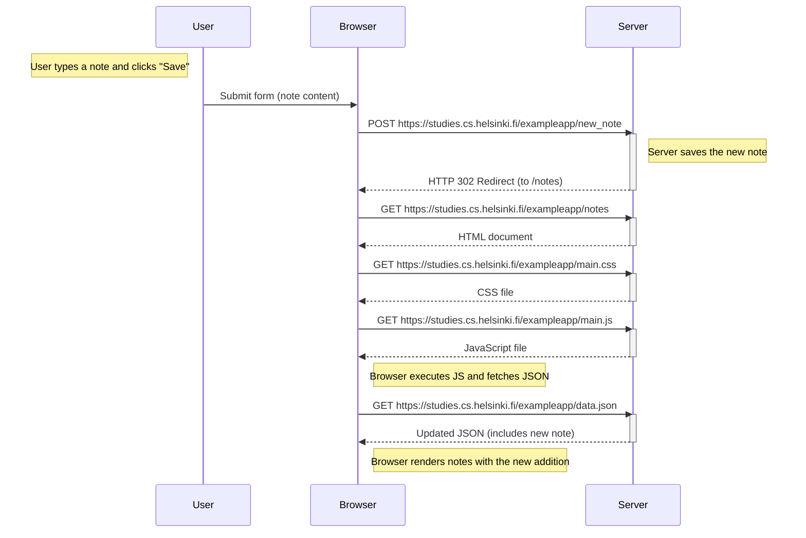

```mermaid
sequenceDiagram
    participant User
    participant Browser
    participant Server

    Note left of User: User types a note and clicks "Save"

    User->>Browser: Submit form (note content)
    Browser->>Server: POST https://studies.cs.helsinki.fi/exampleapp/new_note
    activate Server
    Note right of Server: Server saves the new note
    Server-->>Browser: HTTP 302 Redirect (to /notes)
    deactivate Server

    Browser->>Server: GET https://studies.cs.helsinki.fi/exampleapp/notes
    activate Server
    Server-->>Browser: HTML document
    deactivate Server

    Browser->>Server: GET https://studies.cs.helsinki.fi/exampleapp/main.css
    activate Server
    Server-->>Browser: CSS file
    deactivate Server

    Browser->>Server: GET https://studies.cs.helsinki.fi/exampleapp/main.js
    activate Server
    Server-->>Browser: JavaScript file
    deactivate Server

    Note right of Browser: Browser executes JS and fetches JSON

    Browser->>Server: GET https://studies.cs.helsinki.fi/exampleapp/data.json
    activate Server
    Server-->>Browser: Updated JSON (includes new note)
    deactivate Server

    Note right of Browser: Browser renders notes with the new addition
```