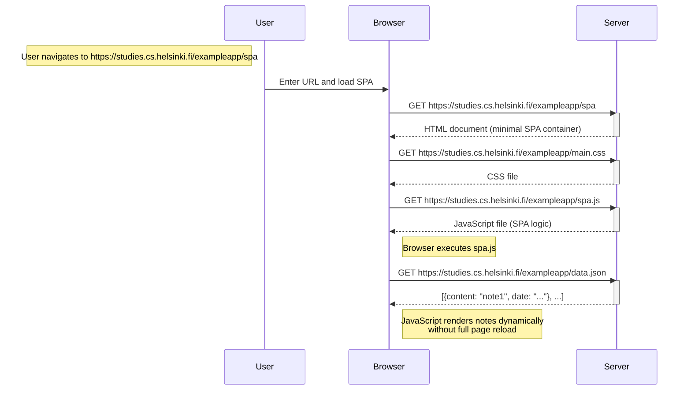

```mermaid
sequenceDiagram
    participant User
    participant Browser
    participant Server

    Note left of User: User navigates to https://studies.cs.helsinki.fi/exampleapp/spa

    User->>Browser: Enter URL and load SPA
    Browser->>Server: GET https://studies.cs.helsinki.fi/exampleapp/spa
    activate Server
    Server-->>Browser: HTML document (minimal SPA container)
    deactivate Server

    Browser->>Server: GET https://studies.cs.helsinki.fi/exampleapp/main.css
    activate Server
    Server-->>Browser: CSS file
    deactivate Server

    Browser->>Server: GET https://studies.cs.helsinki.fi/exampleapp/spa.js
    activate Server
    Server-->>Browser: JavaScript file (SPA logic)
    deactivate Server

    Note right of Browser: Browser executes spa.js

    Browser->>Server: GET https://studies.cs.helsinki.fi/exampleapp/data.json
    activate Server
    Server-->>Browser: [{content: "note1", date: "..."}, ...]
    deactivate Server

    Note right of Browser: JavaScript renders notes dynamically<br>without full page reload
```