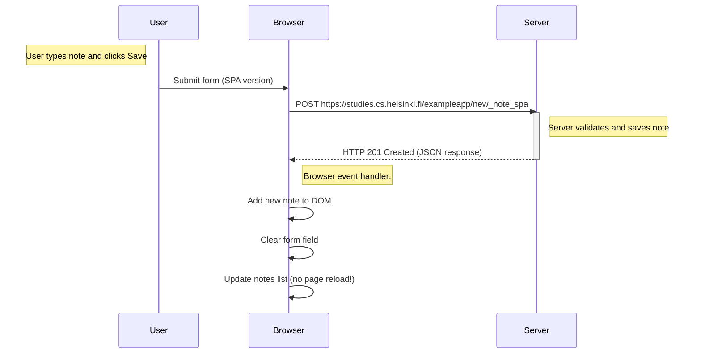

```mermaid
sequenceDiagram
    participant User
    participant Browser
    participant Server

    Note left of User: User types note and clicks Save

    User->>Browser: Submit form (SPA version)
    Browser->>Server: POST https://studies.cs.helsinki.fi/exampleapp/new_note_spa
    activate Server
    Note right of Server: Server validates and saves note
    Server-->>Browser: HTTP 201 Created (JSON response)
    deactivate Server

    Note right of Browser: Browser event handler:
    Browser->>Browser: Add new note to DOM
    Browser->>Browser: Clear form field
    Browser->>Browser: Update notes list (no page reload!)
```